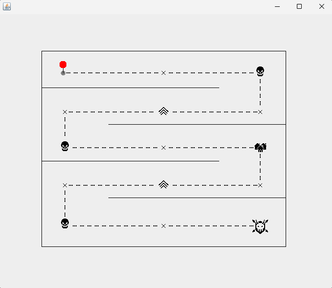

# Milestone 2: Graphical Overworld Interface & Vector Render Loops

This branch marks the transition of the RPG engine from a console-based text matrix into a standalone desktop application window. This milestone isolates the development of the graphical overworld exploration layer, using automated coordinate drawing loops and pre-rendered graphic assets.

## Live Overworld Preview

---

## Architectural Overview

The application moves out of the terminal environment by utilizing Java's native **Abstract Window Toolkit (AWT)** and **Swing** frameworks:
1. **`JFrame` (Application Shell):** Serves as the independent native OS window wrapper, setting up window boundaries, close routines, and basic container sizing.
2. **`GamePanel` (Render Canvas):** A custom class extending `JPanel` that overrides the native graphics pipeline (`paintComponent`) to act as a double-buffered vector canvas.

---

## Key Engineering Concepts Implemented

### 1. Programmatic Path Rendering Loops
Instead of drawing individual environmental paths manually using hardcoded, static layout methods, the overworld map builds its pathways programmatically. Using incremental `for`-loops inside the graphics pipeline, it draws segments of `line.png` and `VLine.png` spaced evenly across coordinate intervals (e.g., `pathY += 15`):
* **Dynamic Grid Mapping:** Automatically paths complex multi-turn corridors across the window container dimensions.
* **Decoupled Coordinates:** Changes to map scale or lane density can be modified natively within the algorithmic loop bounds rather than re-plotting every visual asset.

### 2. Native File Asset Ingestion Pipeline
Pre-rendered external image assets are processed through Java's `ImageIcon` layout bridge to transform raw file data into high-performance `Image` buffers memory-ready for painting:
* **Interactive Elements Spawning:** Maps clear pixel layouts to dynamically draw the player pin marker, static checkpoint encounters (`x.png`), level checkpoints (`level-up.png`), enemy nodes (`skull.png`), and destination markers (`boss.png`, `house.png`).

### 3. Active Window Refresh Optimization
Leverages `super.paintComponent(g)` at the start of every render pass to manage smooth canvas resets. This ensures that when entities move or backgrounds refresh, previous graphic traces are instantly cleared from the computer's memory buffers, preventing screen tearing or sprite bleeding.

---

## Creative Assets Integrated
All graphics are rendered using custom, retro-handheld pixel assets imported directly into the engine layout directory:
* `skull.png` – Enemy encounter nodes
* `house.png` / `boss.png` – Hub areas and final challenge zones
* `line.png` / `VLine.png` – Horizontal and vertical corridor tracks

---
*This branch tracks the UI layer evolution of the project. See the master (`main`) branch for active developments involving LibreSprite cinematic animations (intro, battle, endings), CardLayout scene controllers, and audio engines.*
