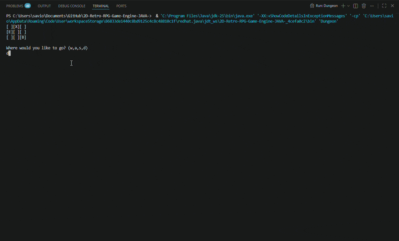

# Milestone 1: Core 2D Grid Matrix & Input State Loop

This branch houses the foundational engine logic and coordinate layout for the 2D RPG. Before developing complex graphical viewports, this initial milestone establishes the structural game state matrix, player movement mechanics, and strict spatial boundary constraints entirely within a console environment.

## Live Matrix Preview

---

## Architectural Overview & Mechanics

The engine relies on a modular, decoupled structure splitting execution responsibility across three primary controller classes:

1. **`Dungeon.java` (Application Entrypoint):** Instantiates the game state and kicks off the core execution loops.
2. **`Player.java` (Input Handlers):** Manages real-time data ingestion using a `Scanner` stream to capture movement vectors (`w`, `a`, `s`, `d`) and logs the player's immediate coordinate indexes.
3. **`DungeonMap.java` (State Matrix & Logic):** Directs matrix transformations, handles tile re-rendering, and enforces collision maps.

---

## Key Engineering Concepts Implemented

### 1. 2D Coordinate Matrix
The world is mapped onto a 3/3 memory grid using a 2D String array matrix (`String[][] map`). This acts as the structural proof-of-concept for spawning entities programmatically at targeted indexes:
* `[X]` - Dynamic Player Entity Marker
* `[E]` - Enemy Static Encounter Tile
* `[B]` - Boss Encounter Tile

### 2. State Mutation & Render Cycles
The game utilizes an active update loop (`Update()`). When valid movement inputs are received, a sequential transactional operation is triggered:
1. The player’s historical grid position index is wiped and reset to a clean tile (`[ ]`).
2. Coordinate indices (`Row`, `Col`) are updated based on the directional direction vector.
3. The new target index is populated with the entity marker (`[X]`) and the matrix is printed immediately to the terminal output stream.

### 3. Algorithmic Border Constraints (Edge Detection)
To maintain structural stability and prevent application crashes, the update loop utilizes conditional guard clauses before index modifications. These boundary checks safely stop the player from stepping out of bounds and throwing an `ArrayIndexOutOfBoundsException`.

---
*This branch acts as a historical freeze point showing my progress learning Java. See the master branch for the upgraded GUI-driven implementation featuring custom pixel art animations and sound system pipelines.*****
